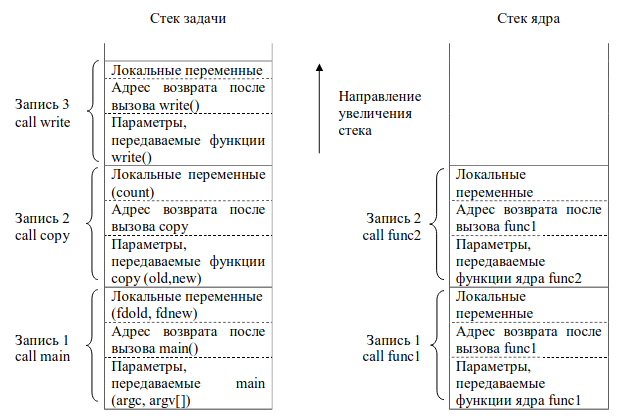

# 5. Архитектура ОС

Три основные компоненты:

1. Подсистема управления файлами.\
   Управляет файлами, свободным дисковым пространством. Размещает записи файлов, выполняет поиск данных в файле.
2. Подсистема управления процессами.\
   Резервирует ресурсы, определяет последовательность выполнения процессов, их синхронизацию и взаимодействие. Управляет оперативной памятью, реализует механизм разделения времени.&#x20;
3. Подсистема управления устройствами.
4. Первые 2 из них являются машинно-независимыми, последняя компонента является частично машинно-зависимой. Подсистемы управления процессами и устройстами в совокупности образуют подсистему ввода-вывода.&#x20;

С практической точки зрения процесс является объектом

<figure><figcaption><p>Рис. 1</p></figcaption></figure>

С практической точки зрения процесс является объектом, в результате выполнения системного вызова fork(). Тот процесс, который создает, называется родительским процессом: тот, который создается. называется порожденным процессом.&#x20;

Процесс предусматривает строго последовательные действия. При необходимости выполнять действия асинхронно с процессом, необходимо породить новый процесс.&#x20;

<figure><figcaption><p>Рис. 2 </p></figcaption></figure>

В том момент, когда возникает потребность в операциях ввода-вывода, создается новый процесс, после чего процессы как-либо синхронизируются.&#x20;

Загружаемый ядром процесс может состоять из 3 сегментов (областей):

* Процедурный (сегмент текста)
* Сегмент данных
* Сегмент стека

Сегмет текста содержит команды и константы программы, которые составляют процесс. Сегмент данных содержит те данные, которые определены на этапе компиляции исходного текста программы (bss-данные). Сегмент текста и сегмент данных в реентерабельной.&#x20;

Сегмент стека создается автоматически во время запуска процесса. Размер определяется динамически. Стек состоит из логических записей активации, которые помещаются в стек при выхове очередной функций и выталкиваются из стека при возврате из функций.&#x20;

Запись активации содержит параметры вызываемой функции, локальные переменные этой функции и данные, необходимые для восстановления предыдущей записи активации. Поскольку имеется 2 режима: пользовательский и ядра, для каждого из этих режимов существует свой отдельный стек.

```c
Пример:
#include <fcntl.h>
char buffer[2048]; //bss-данные
void copy (int, int);
int main (int argc, char* argv[]){
    int fdold, fdnew;
    ……….
    fdold = open (argv[1], O_RDONLY); /*Исходный файл открыт для чтения*/
    fdnew = creat (argv[2], 0666); /*Создан файл с определенными правами*/
    copy (fdold, fdnew);
    exit(0);
}
void copy (int old, int new){
    int count;
    while ((count = read (old, buffer, sizeof (buffer))) > 0)
        write (new, buffer, count); ‹ Рассмотрим стек в этой точке
}

```

<figure><figcaption><p>Рис. 3</p></figcaption></figure>

Предполагаем, что write вызывает функцию func1, которая в свою очередь, вызывает func2.&#x20;

При возврате из функций записи "выталкиваются" из стека

В общем случае, области данных может и не быть.&#x20;

Каждому процессу соответствует точка входа в таблицу процессов ядра и выделяется область оперативной памяти, отведенная под задачу пользователя (u-area = u-область). \
Таблица процессов включает в себя указатели на промежуточную таблицу областей процессов, элементы которой являются указателями собственно на таблицу областей.&#x20;

Областью называется непрерывная зона адресного пространства, которая выделяется для размещения текста, данных и стека.

Записи в таблице областей описывают атрибуты этой области и указывают, где конкретно размещена в памяти эта область.

Уровень косвенной адресации посредством промежуточной таблицы областей позволяет независимым процессам совместно использовать ту или иную область.&#x20;

<figure><figcaption><p>Полцессы 1 и 2 используют один и тот же процедурный сегмент. Порождаемый процесс создается копированием всех записей в таблицах.</p></figcaption></figure>
