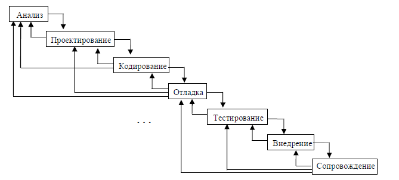

# URVS

Что понимается под разработкой программ? Под разработкой программы понимается технологический многостадийный процесс создания отторгаемого программного продукта,
\
на разных стадиях разработки которого работают разные люди.
\


Существуют две основные модели жизненного цикла программы:

<figure><figcaption><p>Рис 1. Каскадная модель</p></figcaption></figure>

В любой момент разработки возможен возврат назад на любой этап.

<figure><figcaption><p>Рис 2. Спиральная модель</p></figcaption></figure>

_**Анализ:**_ На этом этапе нужно решить, стоит ли создавать новую программу. Возможно,
\
уже созданы программы, решающие данную задачу. Если есть средства разрешения
\
проблемы, которые будут заведомо хуже вашего продукта, то и в этом случае нужно
\
проанализировать, будут ли затраты на создание программного продукта соизмеримы с
\
потерями при использовании худших средств решения проблемы. И только
\
проанализировав затраты, нужно приступать (или не приступать) к созданию
\
программного продукта.&#x20;

_**Проектирование:**_ Нужно запомнить одну непреложную истину: нельзя сразу
\
приступать непосредственно к процессу кодирования. Такой подход применим только для
\
очень маленьких программ, но никак не к программным продуктам.

На этом этапе следует провести тщательный анализ исходной задачи, построить
\
различные схемы и диаграммы. Нужно продумать несколько подходов к решению
\
проблемы и выбрать из них наилучший. Необходимо выделить относительно независимые
\
подзадачи, отделить их друг от друга в разных модулях, спроектировать потоки данных
\
между модулями и внутри их.

_**Кодирование:**_ Существуют различные стили программирования. Среди них нет
\
лучшего или худшего, все они имеют право на жизнь, впрочем, стоит различать
\
свойственные разным языкам стили программирования и не писать на языке Си так, как
\
принято на Фортране.
\
Тем не менее, есть некоторые общие аспекты в написании программ, которых нужно придерживаться.&#x20;

<mark style="color:orange;">Программа должна быть ясной.</mark> Не так сложно несколько раз нажать кнопку
\
Tab, чтобы отделить вложенные блоки от внешних. Желательно разделять
\
относительно независимые блоки одной или несколькими пустыми строками, это
\
увеличивает читабельность программы.

Разумное использование комментариев и согласованное употребление
\
отступов может сделать чтение и понимание программы более приятным
\
занятием. При неправильном использовании комментариев может серьезно
\
пострадать читабельность программы.
\
К сожалению, компилятор не может проверить, что комментарий:

* содержателен;
* имеет какое-то отношение к программе;
* не устарел.

В большинстве программ можно найти труднопонимаемые, противоречивые и
\
просто неверные комментарии. Плохой комментарий хуже его отсутствия.
\
Если что-то может быть выражено непосредственно конструкциями языка, так
\
оно и должно быть сделано, простого упоминания в комментарии недостаточно:

```
//переменную “v” надо проинициализировать
//переменная “v” должна использоваться только функцией “f()”
//перед вызовом любой другой функции из этого файла, вызовите функцию “init()”
//вызовите функцию “cleanup()” в конце вашей программы
```

При правильном использовании языка программирования, такие комментарии
\
часто становятся ненужными.
\
Если что-либо ясно выражено в языке, не надо это повторять второй раз в
\
комментарии:

```
a=b+c; //а принимает значение, равное b+c
count++; //увеличили счётчик
```

Хорошим стилем будет использование комментариев в следующих случаях:

* Комментарии в начале каждого файла исходного кода, где поясняются
  \
  основные объявления, делаются ссылки на литературу и приводятся наиболее
  \
  важные соображения по поводу сопровождения и т. п.
* Комментарии для каждого класса, шаблона и пространства имён.
* Комментарий для каждой нетривиальной функции, в котором указано её
  \
  назначение, использованный алгоритм (если он не очевиден) и, может быть,
  \
  предположения, которые она делает об окружении.
* Комментарии для каждой глобальной переменной, переменной из пространства
  \
  имён и константы.
* Небольшие комментарии в тех местах, где код неочевиден и/или непереносим.
* Очень редко в других случаях.

Удачно подобранный и написанный набор комментариев является
\
существенной частью хорошей программы. Написание «правильных»
\
комментариев может оказаться не менее сложной задачей, чем написание самой
\
программы. Стоит развивать это искусство.
\
Если в функции используется только //-стиль комментариев, то любой
\
фрагмент функции может быть «закомментирован» (временно исключён) при
\
помощи /\* \*/ и наоборот, но не стоит использовать оба типа комментариев как для
\
исключения временно ненужных частей кода, так и для пояснения текста
\
программы.

Стоит давать осмысленные имена переменным, как `count, day, PersonName`. Их
\
использование не позволит вам запутаться, тогда как переменные `j72, Masha154,`
\
`qwerty, aaa` могут причинить кучу неприятностей.

Эффективность стоит повышать в конце работы, когда вы уже добьетесь
\
правильной (пусть неоптимальной) работы программы. После можно выделить
\
критические части программы и, возможно, переписать его средствами Си низкого
\
уровня, а то и вовсе на Ассемблере. Пусть Вы переделаете половину программы,
\
но Вы будете знать, что ваша программа работает, иначе это может привести к
\
бесконечной оптимизации, путанице и стопору в работе.

_**Отладка:**_ Программа должна работать на любых входных данных. Если они
\
неправильны – выдавать сообщение об ошибке. Нельзя надеяться на правильность входных
\
данных, и, тем более, на правильную последовательность действий пользователя.
\
Пользователь по природе своей склонен нажимать все кнопки и в разной
\
последовательности. Он из любопытства своего будет мучить вашу программу во
\
всевозможных ситуациях, и в этом случае надо не потерять лица, кто знает, быть может,
\
пользователь будет пользоваться продукцией вашего конкурента, который будет следить за
\
неправильными данными и неправильными действиями пользователя.

_**Тестирование:**_ К этому этапу создания программного продукта стоит привлекать
\
посторонних людей. Лучше, если они не будут знать, как работает ваша программа.
\
Мыслительные процессы других людей отличаются от ваших; велика вероятность, что они
\
найдут ошибки, которые Вы не заметили.
\
<kbd>_Главный тезис: «Все ошибки предпоследние»._</kbd>

_**Внедрение:**_ Обычно ограничиваются вышеперечисленными этапами. Принято считать,
\
что главное – написание программы, а пользоваться ею начнут автоматически. Увы, все
\
несовершенно в этом мире, и потому наши мечты не склонны сбываться. Приходится
\
объяснять рядовому пользователю, что ваша программа гораздо лучше программы
\
конкурента, работает раза в два быстрее, да и вообще… И тут разработчики сталкиваются с
\
извечной консервативностью конечных пользователей. Ну как объяснишь обычному
\
человеку, что пингвины гораздо лучше разноцветных окон?!?
\
Этап внедрения зачастую отнимает больше сил и времени, чем все остальные этапы
\
разработки программного продукта, и не нужно этим этапом пренебрегать.

_**Сопровождение:**_ Этап сопровождения заключается в поддержке ранее выпущенных
\
программ, исправлении обнаруженных ошибок, выпуске новых версий… Чем лучше Вы
\
все сделали раньше, тем легче будет этот этап. Но если хоть на одном из этапов разработке
\
программного продукта Вы поленились, то процесс сопровождения может превратиться в
\
сущий Ад.
