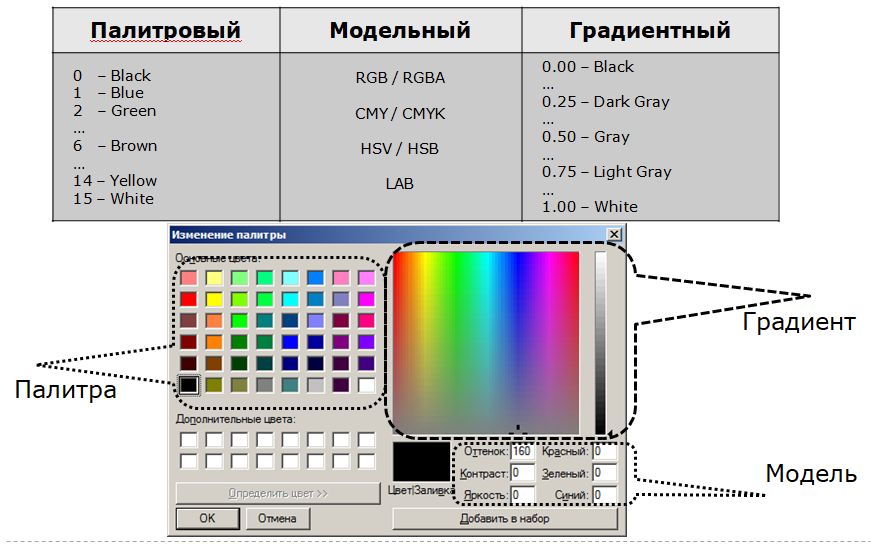

# 1. Введение в КГ

### Определение термина "Компьютерная графика"

* Изображение, созданное с помощью компьютера (CG)
* Программные инструменты, используемые для создания изображений (Photoshop, DirectX, ...)
* Аппаратные инструменты, используемые для создания изображений (мониторы, системы виртуальной реальности)

В общем случае - компьютерная графика - это область информатики, охватывающая все стороы формирования изображений с помощью компьютера.

### Направления:

#### Изобразительная компьютерная графика

Объекты:

* Синтезированные изображения

Задачи:

* Генерация и изменение изображения
* Построение и преобразование модели объекта
* Идентификация объекта и получение требуемой информации

Примеры:

* Создание рисунков в Photoshop
* Визуализация полей специальным ПО

#### Обработка и анализ изображений

Объекты:&#x20;

* Цифровые изображения (фотографии)

Задачи:

* Повышение качества изображения
* Оценка изображения (определение формы, местоположения, размеров)
* Распознавание образов

Примеры:

* Обработка аэрокосмических снимков
* Ввод чертежей

#### Персептивная компьютерная графика (анализ сцен)

Объекты:&#x20;

* Синтезированные и выделенные на фотоснимках изображения

Задачи:

* Исследование абстрактных моделей графических объектов и взаимосвязей между ними

Примеры:

* машинное зрение (роботы)
* анализ рентгеновских снимков

#### Когнитивная (способствующая познанию) графика

* Только формирующееся новое направление
* Для научных абстракций

Задачи:

* Визуализация тех знаний, для которых пока еще не существует символических описаний
* Поиск путей перехода от образа к формулировке гипотезы о механизмах и процессах, представленных этими образами
* Создание таких моделей представления знаний, в которых можно было бы однообразно представлять объекты, зарактерные и для логического, и для образного мышления

### Момент истории

1961 - С. Рассел возглавил проект по созданию первой компьютерной игры "Spacewar!" с графикой на машине PDP-1

1963 - А. Сазерленд создал программно-аппаратный комплекс Sketchpad, который позволял рисовать и редактировать точки, линии и окружности на трубке цифровым первом (первый векторный редактор)

1968 - Группа под руководством Н. Константинова создала модель движения кошки на основе решения дифф. уравнений. Программа, написанная для БЭСМ-4, рисовала на принтере м/ф "Кошечка".&#x20;

### Типы изображений

| Типы изображений | Способ описани                                   |
| ---------------- | ------------------------------------------------ |
| Растровые        | Матрица (растр) пикселей                         |
| Векторные        | Набор примитивов                                 |
| Фрактальные      | Алгоритм или набор уравнений (с  коэффициентами) |

Пиксель (pixel - picture's element, picture cell) - минимальная единица растрового изображения.&#x20;

Геометрический примитив (geometric primitive) - простейшная (элементарная) геометрическая фигура, которую можно обработать и отрисовать.

### Сравнение типов

| Критерий           | Растровое изображение                                | Векторное изображение                           |
| ------------------ | ---------------------------------------------------- | ----------------------------------------------- |
| Элементы (объекты) | пиксели                                              | примитивы                                       |
| Сложность рисунка  | любая                                                | схематичная                                     |
| Распространенность | высокая                                              | только для векторных графических систем         |
| Скорость обработки | высокая                                              | низкая                                          |
| Размер файла       | зависит в основном от разрешения                     | зависит основном от количества объектов         |
| Масштабирование    | с искажениями                                        | почти без потерь                                |
| Форматы файлов     | BMP, JPG, GIF, PNG                                   | AI, CDR, SWF, WMF/EMF                           |
| Параметры задания  | 
разрешение (640x480) цветовая модель (RGB)
 | 
Координаты примитивов цвет заполнения
 |

### Представление цвета

<figure><figcaption></figcaption></figure>

* Цвет - набор определенных длин волн, отраженных от предметов
* Число каналов - количество простых (базовых цветов)
* Цветовая модель - способ представления доступного множества цветов (цветового пространства) посредством их разложения на простые составляющие
* Ахроматические цвета - оттенки серого цвета (для черно-белого диапозона)
* Дополнительные цвета - пары цветов, которые при смешивании дают ахроматические цвета
* Первичный цвет - базовый цвет
* Вторичный цвет - цвет, получившийся в результате попарного смешивания первичных цветов
* Глубина (размерность) цвета - число бит, отводимых на цвет

| Разрядность | Название             | Количество доступных цветов                              |
| ----------- | -------------------- | -------------------------------------------------------- |
| 1           | монохромное          | 2                                                        |
| 8           | восьмиразрядное      | 2^8 = 256                                                |
| 16          | High Color (HiColor) | 32x64x32 = 65 536                                        |
| 24          | True Color           | 256x256x256 = 16 777 216                                 |
| 30/36/48    | Deep Color           | 
яркость "белее белого" "отрицательная яркость"
 |

### Цветовой круг Иттена - 1961

<figure><figcaption></figcaption></figure>

Сочетания цветов:

* Комплементарное - энергичное сочетание цветов, которые расположены на противоположных сторонах
* Триадное - гармоническое сочетание 3-4 цветов, лежащих на одинаковом расстоянии друг от друга
* Аналогичное - спокойное сочетание 2-5 цветов, расположенных подряд

### Цветовой круг RGB

<figure><figcaption></figcaption></figure>

7 цветов радуги + пурпурный = восьмисекторный круг

Опорные цвета - красный, зеленый, синий

Промежуточные цвета - оранжевый, голубой, фиолетовый, пурпурный.

### Модели представления цвета (RGB/CMY)

| Параметр модели                             | Модель RGB                                                                 | Модель CMY                                                                      |
| ------------------------------------------- | -------------------------------------------------------------------------- | ------------------------------------------------------------------------------- |
| Число каналов                               | 3                                                                          | 3                                                                               |
| Первичные цвета                             | 
Red Green Blue
                                                | 
Cyan = White - Red Magenta = White - Green Yellow = White - Blue
   |
| Вторичные цвета                             | 
Cyan = Green + Blue Magenta = Red + Blue Yellow = Reg + Green
 | 
Blue = Cyan * Magenta Red = Yellow * Magenta Green = Yellow * Cyan
 |
| 
Дополнительные цвета  (до белого)
 | 
Cyan + Red Magenta + Green Yellow + Blue
                      | 
Cyan + Red Magenta + Green Yellow + Blue
                           |

### Аддаптивная и перцепционная модели

* Hue - цветовой тон
* Saturation - Насыщенность (чистота цвета)
* Value - Значение цвета
* Brightness - Яркость
* Lightness - Светлота

Диапозон изменений:

* Стандартный: 0.0 - 1.0 или 0 - 100
* Для тона: 0 - 36&#x30;_°_
* В Windows: 0 - 240

<figure><figcaption></figcaption></figure>

### Коды цветов в различных моделях

<figure><figcaption></figcaption></figure>

### Структура графической системы с точки зрения аппаратуры

<figure><figcaption></figcaption></figure>

### Структура графической системы с точки зрения прикладной программы

<figure><figcaption></figcaption></figure>

### Общая схема вывода изображения

<figure><figcaption></figcaption></figure>

### Структура видеопамяти

<figure><figcaption></figcaption></figure>

### Обозначения разрешающей способности

<figure><figcaption></figcaption></figure>
